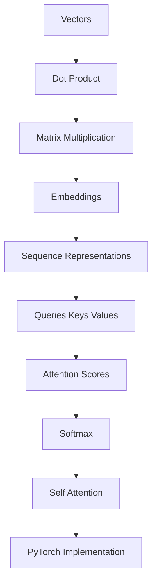

# Map — Implement self-attention from scratch in PyTorch

Updated: 2026-08-17
Goal: Understand self-attention deeply enough to implement it from scratch in PyTorch.

## Learner starting state

All strands are marked as unknown as the native quiz/question tool is unavailable in this non-interactive execution environment. We start teaching from the absolute foundations (Vectors).

## Dependency graph

## Known concepts

| concept | evidence |
|---------|----------|
| none yet | live probing unavailable |

## Weak concepts

| concept | status | evidence |
|---------|--------|----------|
| vectors | unknown | live probing unavailable |
| dot products | unknown | live probing unavailable |
| matrix multiplication | unknown | live probing unavailable |
| embeddings | unknown | live probing unavailable |
| neural networks | unknown | live probing unavailable |
| softmax | unknown | live probing unavailable |
| sequence representations | unknown | live probing unavailable |

## Planned teaching path

1. Vectors
2. Dot product
3. Matrix multiplication
4. Embeddings
5. Softmax
6. QKV
7. Self-attention
8. PyTorch implementation

## Current node

Vectors

## Future nodes

- Dot product
- Matrix multiplication
- Embeddings
- Sequence representations
- Softmax
- Self-attention
- PyTorch implementation

## Strands

| strand | status | evidence |
|--------|--------|----------|
| vectors | unknown | live probing unavailable |
| dot products | unknown | live probing unavailable |
| matrix multiplication | unknown | live probing unavailable |
| embeddings | unknown | live probing unavailable |
| neural networks | unknown | live probing unavailable |
| softmax | unknown | live probing unavailable |
| sequence representations | unknown | live probing unavailable |

Status: `known` | `edge` | `unknown` | `blocked`

## Quiz log

- none yet
