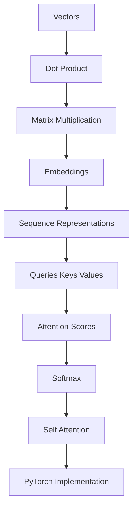

# Session

Topic: self-attention

Goal: Understand self-attention deeply enough to implement it from scratch in PyTorch.

Starting knowledge: All strands unknown at launch. Probing was skipped because the OpenCode native `question` tool is unavailable in this environment.

## Current node

Vectors — geometric objects with magnitude and direction; represented computationally as an ordered list of numbers (a 1D array/tensor) that can be added and scaled.

## What was taught

We defined a vector from first principles as an element of a vector space. In deep learning and PyTorch, we treat a vector as a 1D tensor representing features (e.g., word embeddings or token representations). The two core vector space operations are vector addition ($u + v$) and scalar multiplication ($c \cdot v$). These operations produce new vectors within the same space, allowing us to combine and transform representations without leaving the feature space.

## Learner response

Non-interactive run; no direct learner interaction could be collected.

## Quiz result

SKIPPED — OpenCode `question` was not available in this non-interactive run. No lock-in. Do not treat this node as understood.

## Diagnosis

Material was exposed (one definition of vectors as 1D feature tensors). Without a quiz, the next live `/teach` must probe or quiz this node before advancing to dot product.

## Knowledge update

Wrote `.alvar/knowledge/vectors.md` with `mastery_level: EXPOSED`, `status: partial`. No fake PASS. Updated `.alvar/LEARNER.md`.

## Next node

Dot product

## Open questions

- Does the learner already use NumPy or PyTorch tensors as vectors?
- Are they comfortable with basic linear combinations?

## Plan

