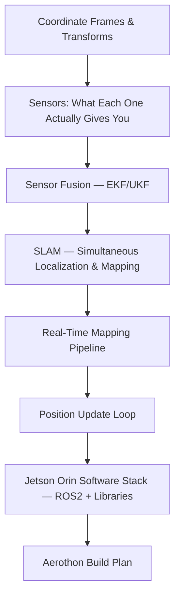

# Session — Real-Time Drone Mapping & Position Update
Date: 2026-08-18
Model: opencode/big-pickle
Goal: Learn how real-time mapping and position updating works in drones for Aerothon hackathon

## Plan

### Node descriptions
- **A — Coordinate Frames & Transforms**: Body frame, world frame, why transforms matter for fusing data. (edge)
- **B — Sensors: What Each One Actually Gives You**: IMU → acceleration/rotation rate, GPS → lat/lon/alt, LiDAR → point cloud, camera → images. What each sensor is good/bad at. (known → deepen)
- **C — Sensor Fusion — EKF/UKF**: How you combine noisy sensors to estimate position + velocity. The intuition behind Kalman: predict → update. (edge)
- **D — SLAM**: How a drone builds a map while simultaneously localizing in it. Visual SLAM vs LiDAR SLAM. (edge)
- **E — Real-Time Mapping Pipeline**: From raw sensor data → processed map (occupancy grid, octomap, etc.). Latency constraints. (unknown)
- **F — Position Update Loop**: The flight controller loop — how estimated state feeds back into control. (unknown)
- **G — Jetson Orin Software Stack**: ROS2, relevant packages (cartographer, ORB-SLAM3, PX4), running on Jetson. (unknown)
- **H — Aerothon Build Plan**: Putting it together — what hardware, what software, what you actually need to code. (unknown)

## Log

### Node: Coordinate Frames & Transforms
- taught: Body frame (drone-fixed) vs world frame (Earth-fixed). Rotation matrix/quaternion converts between them. transform = R × body_point + position. Every sensor reading must be in the same frame before fusion.
- visual: coord-frames-1.svg (body vs world frame diagram)
- quiz: Q1 — drone pitches 45°, tree originally below is now "below and forward" in body frame
- result: lock-in
