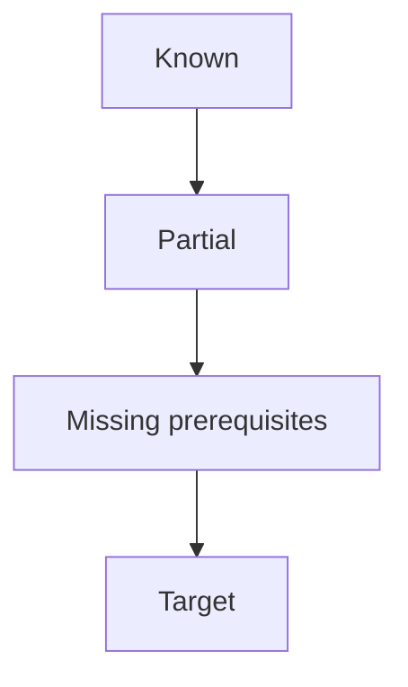

# Map — <goal>

Updated: <YYYY-MM-DD>
Goal: <one sentence>

## Learner starting state

<what is known / partial / missing, from probe evidence — not assumed>

## Dependency graph

Replace the placeholder graph with the real DAG before teaching. The graph is the teaching plan, not decoration.

## Known concepts

| concept | evidence |
|---------|----------|
| | |

## Weak concepts

| concept | status | evidence |
|---------|--------|----------|
| | edge / unknown / blocked | |

## Planned teaching path

1. <node>
2. <node>

## Current node

<none | node name>

## Future nodes

- <node>

## Strands

| strand | status | evidence |
|--------|--------|----------|
| | known / edge / unknown / blocked | |

Status: `known` | `edge` | `unknown` | `blocked`

## Quiz log

- Q1 [strand] <letter> — correct|wrong|idk — <five words>
