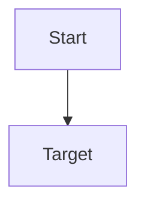

# Session

Topic:

Goal:

Starting knowledge:

## Current node

...

## What was taught

...

## Learner response

...

## Quiz result

...

## Diagnosis

...

## Knowledge update

...

## Next node

...

## Open questions

...

## Plan

