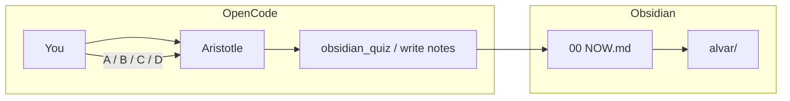

# Aristotle

A local, one-to-one tutor. You talk in [OpenCode](https://opencode.ai). Notes, maps, and quizzes live in [Obsidian](https://obsidian.md). State is Markdown on disk — not a chatbot history you lose when the session ends.

Teaching method: [Alvarmethod](https://github.com/vasanthsreeram/Alvarmethod) (Alvar method). The product you talk to is **Aristotle**.

```text
OpenCode  →  conversation, one reasoning step at a time
Obsidian  →  current topic, mermaid maps, mermaid quizzes
alvar/    →  the single folder where all learning is saved
```

---

## Contents

- [The problem](#the-problem)
- [What we built](#what-we-built)
- [How the workflow works](#how-the-workflow-works)
- [Setup](#setup)
- [Daily use](#daily-use)
- [Repository](#repository)
- [Commands](#commands)
- [Principles](#principles)

---

## The problem

Usual learning with an LLM is many-to-many and disposable:

| Failure | What happens |
|---------|----------------|
| Generic curriculum | The model reteaches what you already know, or starts in the deep end. |
| Chat as the notebook | Diagrams, quizzes, and “where we left off” vanish when the thread is gone. |
| Quizzes in the transcript | Multiple-choice dumped as `A/B/C/D` in chat is easy to skim and easy to leak. |
| Hidden vault files | State in `.dotfolders` never shows in Obsidian’s file explorer. |
| Browser tabs for HTML | Leaving the tutor and a notes app for a random preview tab breaks focus. |

We wanted one teacher for one mind: calibrate first, teach one node, lock it in, and keep a durable graph of what is known, weak, and next — visible in the vault while you talk.

---

## What we built

Aristotle is this folder. It is not a course catalog and not a web app.

| Goal | What shipped |
|------|----------------|
| Teach *this* learner | Persistent profile at `alvar/LEARNER.md`. Probe before a new subject. |
| One step, then stop | Skill loop: **Probe → Plan → Teach → Verify → Prove**. |
| A plan you can see | Mermaid DAG in `alvar/maps/` before the first lesson node. |
| Quizzes that render | Mermaid quiz in Obsidian (`alvar/quizzes/current.md`), answer **A/B/C/D** back in OpenCode. |
| One place for notes | All maps, sessions, knowledge, figures, and quizzes under **`alvar/`**. |
| Current topic on top | **`00 NOW.md`** at the vault root of Aristotle. The OpenCode plugin refreshes it and opens it in Obsidian. |
| No browser detour | No HTML preview tabs. OpenCode for talk; Obsidian for mermaid. |
| Local models | Default model is Gemini via OpenCode (`google/gemini-3.5-flash`). Keys stay in OpenCode auth, not in git. |

Mastery is recorded per concept (`EXPOSED` → `UNDERSTOOD` → `RETAINED` → `APPLIED` → `MASTERED`). One easy correct answer is not mastery.

---

## How the workflow works



1. You start a lesson in OpenCode (`/teach …`).
2. Aristotle reads `alvar/LEARNER.md` and either resumes a map or probes.
3. A probe or lock-in quiz is written as mermaid to `alvar/quizzes/current.md`.
4. The plugin updates **`00 NOW.md`** (current topic + quiz + map + session) and asks Obsidian to open that note.
5. You look at **Now** in Obsidian, then type **A**, **B**, **C**, or **D** in OpenCode.
6. Aristotle scores, updates the map and knowledge files, and either advances one node or inserts a missing prerequisite.

The filesystem is the database:

| Path | Role |
|------|------|
| `00 NOW.md` | Always-on-top dashboard. Generated; not the source of truth. |
| `alvar/LEARNER.md` | How you learn + current knowledge. |
| `alvar/maps/` | Dependency graph for a goal. |
| `alvar/sessions/` | Resumable session log. |
| `alvar/quizzes/current.md` | Live mermaid quiz. |
| `alvar/knowledge/` | Per-concept mastery. |
| `alvar/visuals/` | Extra mermaid/SVG when a picture earns its keep. |
| `alvar/research/` | Claim checks before something is taught as fact. |

`.alvar` is a symlink to `alvar/` so older skill paths still resolve. **Write to `alvar/`.** Obsidian hides folders that start with a dot.

---

## Setup

### Requirements

- [OpenCode](https://opencode.ai) (`opencode --version`)
- [Obsidian](https://obsidian.md)
- A Google Gemini credential in OpenCode (`/connect` → Google), stored under `~/.local/share/opencode/auth.json`

This repo pins the default model in `opencode.json`:

```json
"model": "google/gemini-3.5-flash"
```

### Obsidian

**Open folder as vault** → this repository (`…/Aristotle`).

You should see `00 NOW.md` at the top of the file list and a folder named `alvar` (no leading dot).

If Obsidian already has a parent folder (for example `Developer`) registered as the vault, Aristotle still works: notes appear as `Aristotle/00 NOW.md` and `Aristotle/alvar/…`. The plugin looks up the registered vault path; it does not assume the vault is named `Aristotle`.

### OpenCode

```bash
cd /path/to/Aristotle
opencode
```

Keep Obsidian open in the background.

---

## Daily use

```text
/teach I want to understand <topic> deeply enough to use it, not recite it.
```

Also: `teach me X`, `help me learn X`, `walk me through X`, `/probe`, `/learn-profile`, `/learn-visual`.

| You | Aristotle | You see |
|-----|-----------|---------|
| State a goal | Loads learner + map, or probes | Quiz mermaid on **Now** |
| Answer A–D in OpenCode | Scores; writes map/session/knowledge | **Now** and `alvar/` update |
| Ask to continue | One node only, then another quiz | Same |

Do not paste multiple-choice into the OpenCode transcript. Do not hunt in `.opencode/` or `.alvar/` for the lesson — that is machinery, not the notebook.

---

## Repository

```text
Aristotle/
├── 00 NOW.md                 # current topic (auto-updated)
├── AGENTS.md                 # tutor operating rules
├── opencode.json             # model + skills
├── alvar/                    # all learning notes
│   ├── LEARNER.md
│   ├── current.json          # pointer used to rebuild Now
│   ├── maps/
│   ├── quizzes/
│   ├── sessions/
│   ├── knowledge/
│   ├── visuals/
│   ├── research/
│   └── templates/
├── .opencode/
│   ├── command/              # /teach, /probe, …
│   ├── plugins/              # Obsidian open + Now + quizzes
│   └── skills/
├── .agents/skills/           # same teaching skills, portable
├── subjects/                 # optional subject notes
└── projects/                 # optional applied work
```

---

## Commands

| Command | Job |
|---------|-----|
| `/teach` | Full loop: probe, plan, one node, lock-in quiz |
| `/probe` | Map only |
| `/learn-profile` | Interview → `alvar/LEARNER.md` |
| `/learn-visual` | One mermaid figure in the vault |

Plugin tools (called by Aristotle, not by you):

| Tool | Job |
|------|-----|
| `obsidian_quiz` | Write mermaid quiz, refresh **Now**, open Obsidian |
| `preview_markdown` | Write a mermaid note under `alvar/visuals/` |

---

## Principles

- Teach **this** learner, at the edge of **this** understanding.
- Do not reteach `known`. Do not start in `unknown` with no ramp.
- Struggle stays in the material. Aristotle absorbs order, files, and “what next.”
- Understanding is not mastery.

Methodology credit: [Eero Alvar — *How I Use AI to Learn Things*](https://youtu.be/kzcI5F4tGiU). Skills pack: [vasanthsreeram/Alvarmethod](https://github.com/vasanthsreeram/Alvarmethod).

---

## Checks

```bash
./scripts/validate.sh
```

Live `/teach` still requires OpenCode + Obsidian running together.
