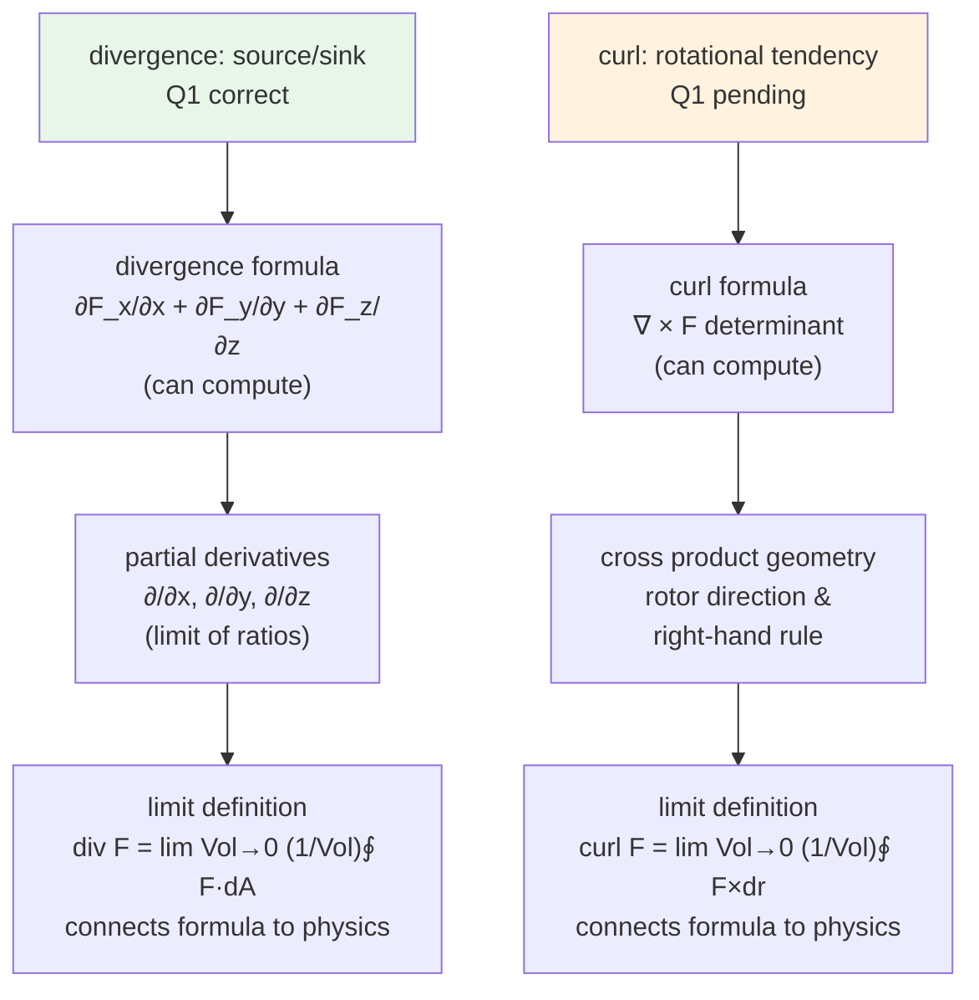

# Map — Understand physically what divergence and curl mean, beyond formulas

Updated: 2026-08-18
Goal: Understand physically what divergence and curl mean, beyond just formulas — starting from intuition down to the partial derivatives.

## Learner starting state

- Can compute divergence via ∂F_x/∂x + ∂F_y/∂y + ∂F_z/∂z — procedural fluency with the component formula.
- Can compute curl via ∇ × F and the determinant mnemonic — procedural fluency with the determinant mnemonic.
- Q1 (divergence physical meaning): answered B correctly — `known` for divergence's physical meaning.
- Q2 (curl physical meaning): pending response.
- Likely gaps: connecting the physical meaning back to the limit definitions, the geometric interpretation of the components, and how the Del operator encodes both ideas.

## Dependency graph

## Known concepts

| concept | evidence |
|---------|----------|
| divergence physical meaning (source/sink) | Q1 correct, B |
| divergence component formula | stated goal: "I know how to solve it with the formula" |
| curl component formula (∇ × F) | stated goal: "I know how to solve it with the formula" |

## Weak concepts

| concept | status | evidence |
|---------|--------|----------|
| curl physical meaning | edge | goal says "idk what it actually means", Q2 pending |
| divergence limit definition | unknown | no evidence given |
| curl limit definition | unknown | no evidence given |
| connecting formulas to physics | unknown | goal implies gap |
| partial derivatives as limits | unknown | prerequisite for limit defs |

## Planned teaching path

1. curl physical meaning: swirling / rotational tendency (lock-in quiz)
2. curl component formula → physical connection: why ∂F_y/∂x − ∂F_z/∂y etc. measures rotation
3. divergence limit definition: flux per unit volume → recovers the component formula
4. curl limit definition: circulation per unit area → recovers the component formula

## Current node

none — waiting for Q2 response

## Future nodes

- divergence component formula derivation
- curl component formula derivation
- geometric interpretation of each partial derivative contribution

## Strands

| strand | status | evidence |
|--------|--------|----------|
| divergence: source/sink physical meaning | known | Q1 correct, B |
| curl: rotational tendency physical meaning | blocked | Q2 pending |
| divergence: limit definition | unknown | no evidence |
| curl: limit definition | unknown | no evidence |
| connecting component formulas to physics | unknown | goal implies gap |

## Quiz log

- Q1 [divergence: source/sink physical meaning] B — correct — spreads out/in at point
- Q2 [curl: rotational tendency physical meaning] — pending
