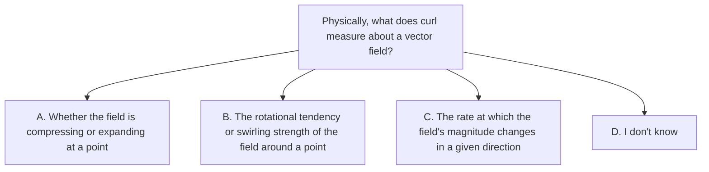

# Quiz — curl-intuition

Answer in the **OpenCode chat**: type **A**, **B**, **C**, or **D**. Do not guess.

- [ ] A — Whether the field is compressing or expanding at a point
- [x] B — The rotational tendency or swirling strength of the field around a point
- [ ] C — The rate at which the field's magnitude changes in a given direction
- [ ] D — I don't know
