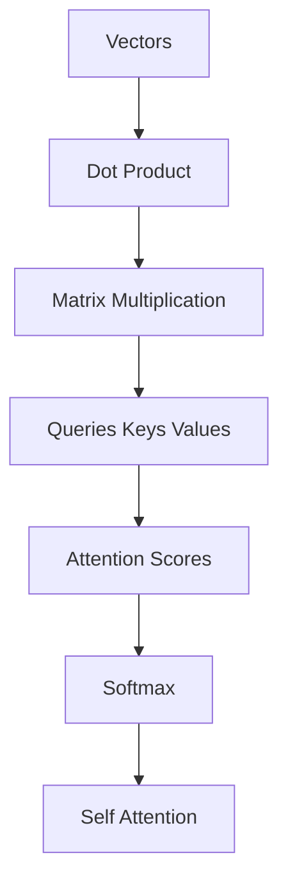

# Session

Topic: self-attention

Goal: Understand self-attention deeply enough to implement it from scratch in PyTorch.

Starting knowledge: unknown (fixture — live probe replaces this)

## Current node

Vectors — geometric object with magnitude and direction; in this path, an ordered list of numbers you can add and scale.

## What was taught

A vector is an element of a vector space. For attention, treat it as a 1D tensor of features. Addition and scalar multiplication must stay in the same space.

## Learner response

fixture — no live answer

## Quiz result

PASS (fixture). Live sessions must use OpenCode `question`, not this file.

## Diagnosis

Lock-in on the definition used later for Q, K, V rows. Not mastery.

## Knowledge update

Wrote `.alvar/knowledge/vectors.md` (or tests/fixtures/knowledge-dot-product.md as schema example). `mastery_level: EXPOSED`.

## Next node

Dot product

## Open questions

Does the learner already use NumPy/PyTorch tensors as vectors?

## Plan

