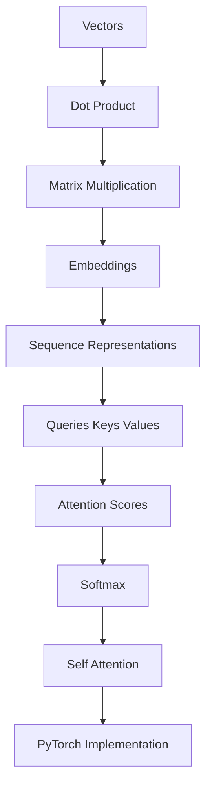

# Map — Implement self-attention from scratch in PyTorch

Updated: 2026-08-17
Goal: Understand self-attention deeply enough to implement it from scratch in PyTorch.

## Learner starting state

All strands unknown until live probing. This fixture shows the graph shape Aristotle must write after a real probe.

## Dependency graph

## Known concepts

| concept | evidence |
|---------|----------|
| | none yet — live probe required |

## Weak concepts

| concept | status | evidence |
|---------|--------|----------|
| softmax | unknown | not probed in this fixture |

## Planned teaching path

1. Vectors
2. Dot product
3. Matrix multiplication
4. Embeddings
5. Softmax
6. QKV
7. Self-attention
8. PyTorch implementation

## Current node

Vectors

## Future nodes

- Dot product
- Matrix multiplication
- Embeddings
- Sequence representations
- Softmax
- Self-attention

## Strands

| strand | status | evidence |
|--------|--------|----------|
| vectors | unknown | fixture |
| dot products | unknown | fixture |
| matrix multiplication | unknown | fixture |
| embeddings | unknown | fixture |
| neural networks | unknown | fixture |
| softmax | unknown | fixture |
| sequence representations | unknown | fixture |

## Quiz log

- none yet
